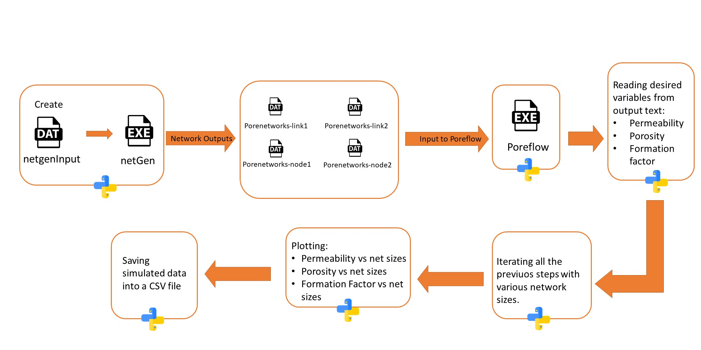

### *Simulating fluid flow in porous media using Poreflow and Netgen porenetwork modeling package*
***
**Name**: Misagh Esmaeilpour 
**Semester**: Spring 2020  
**Project Area**: Flow and Transport in Porous Media

---
**Background:**

Per H. Valvatne (2004) developed a package for generating pore-networks and simulating fluid flow (multi/single phase) through the generated networks to come up with the petrophysical values of the desired porenetworks such as permeability, porosity,etc. The package is a compiled code written in C++, and is composed of two sub-modules called Netgen (porenetwork generator) and Poreflow (fluid flow simulator). 

---
**Objectives:**

1. Observing how the values of permeability, porosity, and formation factor change by changing size of the networks
2. Save a CSV file out of the simulated data
3. Comparison of performance of  Matlab and Python in running simulations.

---

**Sketch**

 The following picture (Fig.1) shows the workflow and steps in runnig the simulations and our code:

    

    <em>Fig.1: Workflow of the project</em>

---
**References**

1. Valvatne, P. H. (2004). Predictive pore-scale modelling of multiphase flow (Doctoral dissertation, Department of Earth Science and Engineering, Imperial College London).
2. Icons made by <a href="https://www.flaticon.com/authors/freepik" title="Freepik">Freepik</a> from <a href="https://www.flaticon.com/" title="Flaticon"> www.flaticon.com</a>

---

