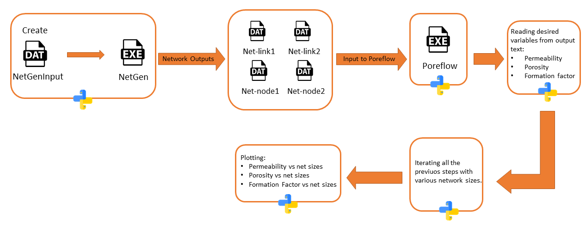

#### Project Proposal:
### *Simulation of fluid flow through porous media using netgen/poreflow porenetwork modeling package*
***
**Name**: Misagh Esmaeilpour 
**Semester**: Spring 2020  
**Project area**: Flow and Transport in Porous Media

---
**Background:**

Per H. Valvatne back in 2004 [1] developed a package for generating pore-networks and simulating fluid flow (multi/single phase) through the generated networks to come up with the petrophysical values of the disired networks such as permeability, porosity,etc. The package is a compiled code written in c++ and could be easily executed by cmd, and is composed of two sub modules called NetGen (pore-network generator) and Poreflow (fluid flow simulator). 

Currently, I am using this package and am running it on Matlab with often over 200 iterations and outputs are saved in the format of _.mat_ files. My main issue is that:

*I am not able to use matlab anymore when the program is running and it could take several days for the program to finish*

---
**Objectives:**

By rewriting my matlab code in python I am aiming to achieve these two goals:

1. not making my Matlab busy for several days

2. Accelerating the computations by using python instead of Matlab (currently a 10 iterations simulation in matlab takes about 20 minutes, and I am hoping to reduce this time)
---

**Outcome:**

Three separate plots showing the trend of changing in the values of permeability, porosity and formation factor while network size is increasing.

    

    <em>Fig.1: A sample figure showing permeability values(k) vs network sizes. </em>

---

**Sketch**

In the following picture (Fig.1) various stages of this project is depicted:

    

    <em>Fig.2: Workflow of the proposed project</em>

---
**References**

1. Valvatne, P. H. (2004). Predictive pore-scale modelling of multiphase flow (Doctoral dissertation, Department of Earth Science and Engineering, Imperial College London).
2. Icons made by <a href="https://www.flaticon.com/authors/freepik" title="Freepik">Freepik</a> from <a href="https://www.flaticon.com/" title="Flaticon"> www.flaticon.com</a>

---

